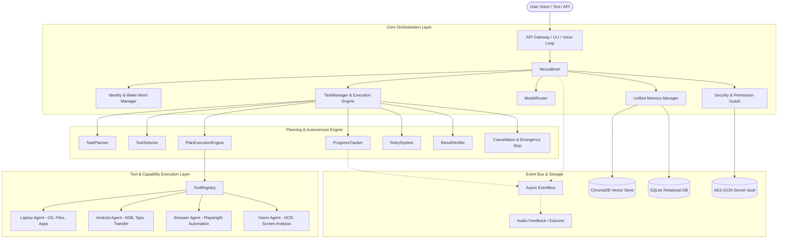

# NEXUS System Architecture

This document details the modular subsystem architecture of **NEXUS**, explaining data flows, component relationships, and concurrency models.

---

## 1. High-Level Architecture Diagram

---

## 2. Subsystem Breakdown

### 1. Core Brain & Orchestration (`nexus.core`)
- **`NexusBrain`**: Central lifecycle coordinator. Routes input through emergency checks, custom macros, offline fallback, confirmations, and multi-step plans.
- **`ModelRouter`**: Dynamically dispatches prompts to optimal models across 4 tiers:
  - `FAST`: Gemini 2.0 Flash / GPT-4o-mini
  - `SMART`: Claude 3.5 Sonnet / GPT-4o
  - `VISION`: Gemini 2.0 Pro Multimodal
  - `LOCAL`: Ollama (Llama 3 / Mistral)
- **`ContextManager`**: Maintains multi-turn conversation memory and sliding working window.

### 2. Autonomous Planning Engine (`nexus.planning`)
- **`TaskPlanner`**: Breaks compound goals into dependency-ordered `PlanStep` graphs.
- **`ToolSelector`**: Matches step descriptions to 60+ system tools and performs runtime parameter interpolation (`{{step_1.output}}`).
- **`PlanExecutionEngine`**: Sequentially executes steps, validates intermediate results, triggers confirmations for risky actions, and performs verification checks.
- **`CancellationManager`**: Manages cooperative `CancellationToken` signals and immediate hard process kills (`EMERGENCY STOP`).

### 3. Unified 6-Category Memory System (`nexus.memory`)
1. **Working Memory**: Current conversation turn context.
2. **Short-Term Memory**: Session history and ephemeral task scratchpad.
3. **Long-Term Memory**: Persistent facts, profile attributes, and learned habits.
4. **Episodic Memory**: Past executed plans, transcripts, and interaction history.
5. **Semantic Memory**: Domain knowledge vector index with ChromaDB embedding retrieval.
6. **Procedural Memory**: Custom macros, multi-step workflows, and execution templates.

### 4. Device & Agent Execution Layer (`nexus.agents`, `nexus.devices`)
- **`LaptopAgent`**: 64 system automation tools (file search, conversion, window management, audio control).
- **`AndroidAgent`**: ADB automation (touch gestures, app launches, notifications, file sync).
- **`BrowserAgent`**: Headless/headful Playwright web automation.
- **`VisionAgent`**: Screen capture, OCR text extraction, UI element bounding box recognition.

---

## 3. Concurrency & Reliability Model

- **Asynchronous Event Loop**: Built on Python `asyncio` with non-blocking I/O.
- **Background Support Tasks**: Long-running dev servers and watchers run as daemon subprocesses.
- **Zero Polling Reactive Wakeup**: EventBus and background workers communicate reactively via async notifications and callbacks.
